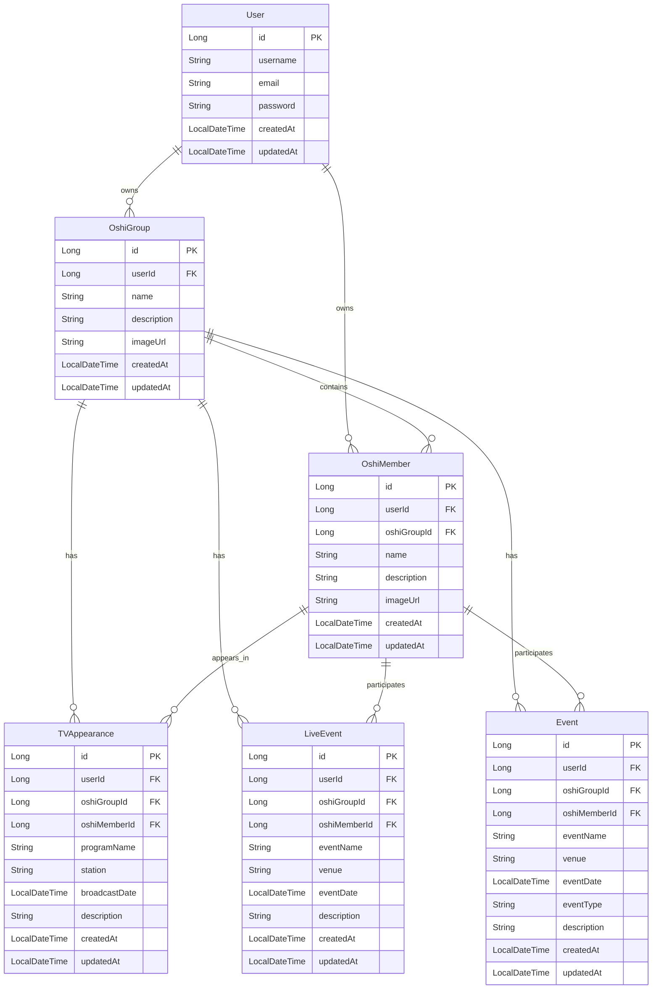

# 推し活支援システム構築計画

## システム概要

Spring Bootベースの推し活支援システムを構築します。複数ユーザーが各自の推しグループ・推しメンを管理し、テレビ出演・ライブ・イベント情報を登録・管理できるシステムです。

## 技術スタック

- **フレームワーク**: Spring Boot 3.x
- **データベース**: MySQL
- **認証・認可**: Spring Security + JWT
- **ORM**: Spring Data JPA
- **ビルドツール**: Maven または Gradle
- **Java**: Java 17以上

## データモデル設計

### エンティティ関係図



## 実装内容

### 1. プロジェクト初期設定

- Spring Bootプロジェクトのセットアップ（Maven/Gradle）
- `application.yml`の設定（MySQL接続、JPA設定）
- 依存関係の追加（Spring Security、JWT、ファイルアップロード）

### 2. エンティティクラス

以下のエンティティクラスを作成：

- `User.java` - ユーザー情報
- `OshiGroup.java` - 推しグループ
- `OshiMember.java` - 推しメン
- `TVAppearance.java` - テレビ出演情報
- `LiveEvent.java` - ライブ情報
- `Event.java` - イベント情報（その他のイベント）

### 3. リポジトリ層

各エンティティに対応するRepositoryインターフェース：

- `UserRepository.java`
- `OshiGroupRepository.java`
- `OshiMemberRepository.java`
- `TVAppearanceRepository.java`
- `LiveEventRepository.java`
- `EventRepository.java`

### 4. サービス層

ビジネスロジックを実装：

- `UserService.java` - ユーザー登録・認証
- `OshiGroupService.java` - 推しグループのCRUD
- `OshiMemberService.java` - 推しメンのCRUD
- `TVAppearanceService.java` - テレビ出演情報のCRUD
- `LiveEventService.java` - ライブ情報のCRUD
- `EventService.java` - イベント情報のCRUD
- `FileStorageService.java` - 画像アップロード・管理

### 5. コントローラー層

REST APIエンドポイント：

- `AuthController.java` - 認証（登録・ログイン）
- `OshiGroupController.java` - 推しグループ管理API
- `OshiMemberController.java` - 推しメン管理API
- `TVAppearanceController.java` - テレビ出演情報管理API
- `LiveEventController.java` - ライブ情報管理API
- `EventController.java` - イベント情報管理API
- `FileUploadController.java` - 画像アップロードAPI

### 6. セキュリティ設定

- `SecurityConfig.java` - Spring Security設定
- `JwtTokenProvider.java` - JWTトークン生成・検証
- `JwtAuthenticationFilter.java` - JWT認証フィルター

### 7. DTO・レスポンスクラス

- リクエスト/レスポンス用のDTOクラス
- エラーハンドリング用のレスポンスクラス

### 8. 例外処理

- `GlobalExceptionHandler.java` - グローバル例外ハンドラー

## 主要APIエンドポイント（予定）

### 認証

- `POST /api/auth/register` - ユーザー登録
- `POST /api/auth/login` - ログイン

### 推しグループ

- `GET /api/oshi-groups` - 一覧取得
- `POST /api/oshi-groups` - 作成
- `GET /api/oshi-groups/{id}` - 詳細取得
- `PUT /api/oshi-groups/{id}` - 更新
- `DELETE /api/oshi-groups/{id}` - 削除

### 推しメン

- `GET /api/oshi-members` - 一覧取得（グループIDでフィルタ可能）
- `POST /api/oshi-members` - 作成
- `GET /api/oshi-members/{id}` - 詳細取得
- `PUT /api/oshi-members/{id}` - 更新
- `DELETE /api/oshi-members/{id}` - 削除

### テレビ出演情報

- `GET /api/tv-appearances` - 一覧取得（グループID/メンバーIDでフィルタ可能）
- `POST /api/tv-appearances` - 作成
- `PUT /api/tv-appearances/{id}` - 更新
- `DELETE /api/tv-appearances/{id}` - 削除

### ライブ情報

- `GET /api/live-events` - 一覧取得（グループID/メンバーIDでフィルタ可能）
- `POST /api/live-events` - 作成
- `PUT /api/live-events/{id}` - 更新
- `DELETE /api/live-events/{id}` - 削除

### イベント情報

- `GET /api/events` - 一覧取得（グループID/メンバーIDでフィルタ可能）
- `POST /api/events` - 作成
- `PUT /api/events/{id}` - 更新
- `DELETE /api/events/{id}` - 削除

### ファイルアップロード

- `POST /api/files/upload` - 画像アップロード

## ファイル構造

```
backend/
├── src/
│   ├── main/
│   │   ├── java/
│   │   │   └── com/
│   │   │       └── oshikatsu/
│   │   │           ├── OshikatsuApplication.java
│   │   │           ├── config/
│   │   │           │   ├── SecurityConfig.java
│   │   │           │   └── JwtTokenProvider.java
│   │   │           ├── controller/
│   │   │           │   ├── AuthController.java
│   │   │           │   ├── OshiGroupController.java
│   │   │           │   ├── OshiMemberController.java
│   │   │           │   ├── TVAppearanceController.java
│   │   │           │   ├── LiveEventController.java
│   │   │           │   ├── EventController.java
│   │   │           │   └── FileUploadController.java
│   │   │           ├── dto/
│   │   │           │   ├── request/
│   │   │           │   └── response/
│   │   │           ├── entity/
│   │   │           │   ├── User.java
│   │   │           │   ├── OshiGroup.java
│   │   │           │   ├── OshiMember.java
│   │   │           │   ├── TVAppearance.java
│   │   │           │   ├── LiveEvent.java
│   │   │           │   └── Event.java
│   │   │           ├── repository/
│   │   │           │   ├── UserRepository.java
│   │   │           │   ├── OshiGroupRepository.java
│   │   │           │   ├── OshiMemberRepository.java
│   │   │           │   ├── TVAppearanceRepository.java
│   │   │           │   ├── LiveEventRepository.java
│   │   │           │   └── EventRepository.java
│   │   │           ├── service/
│   │   │           │   ├── UserService.java
│   │   │           │   ├── OshiGroupService.java
│   │   │           │   ├── OshiMemberService.java
│   │   │           │   ├── TVAppearanceService.java
│   │   │           │   ├── LiveEventService.java
│   │   │           │   ├── EventService.java
│   │   │           │   └── FileStorageService.java
│   │   │           ├── security/
│   │   │           │   └── JwtAuthenticationFilter.java
│   │   │           └── exception/
│   │   │               └── GlobalExceptionHandler.java
│   │   └── resources/
│   │       ├── application.yml
│   │       └── application-dev.yml
│   └── test/
├── pom.xml (または build.gradle)
└── README.md
```

## 実装の優先順位

1. プロジェクトセットアップと基本設定
2. ユーザー認証機能（登録・ログイン）
3. 推しグループ・推しメンのCRUD
4. テレビ出演・ライブ・イベント情報のCRUD
5. 画像アップロード機能
6. エラーハンドリングとバリデーション

## 注意事項

- 各ユーザーは自分のデータのみアクセス可能（認可チェック）
- 画像ファイルは適切なサイズ制限とバリデーションを実装
- 日付・時刻フィールドは適切なタイムゾーン処理を考慮
- 将来的な拡張性を考慮した設計（通知機能など）